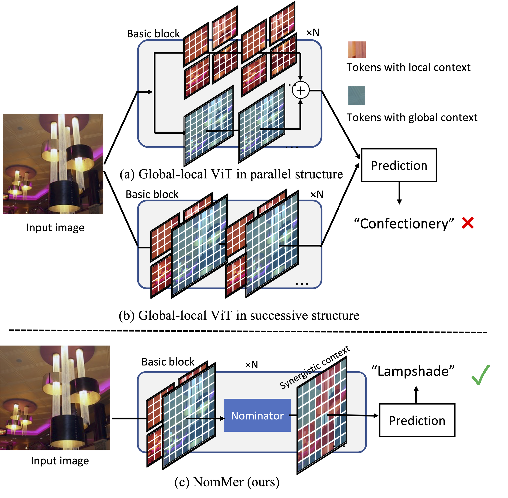

# NomMer Transformer

This is the official implementation of our [NomMer: Nominate Synergistic Context in Vision Transformer for Visual Recognition](https://arxiv.org/pdf/2111.12994.pdf), 
by Hao Liu, Xinghua Jiang, Xin Li, Zhimin Bao, Deqiang Jiang and Bo Ren.

03/02/2022: NomMer got accepted by CVPR 2022.

## Introduction



We propose a novel ViT architecture, termed NomMer, which can dynamically Nominate the synergistic global-local context in vision transforMer.


## Benchmarking 

### Image Classification on [ImageNet-1K](https://www.image-net.org/)

| Model | Pretrain | Resolution | acc@1 | #params | FLOPs |
| :---: | :---: | :---: | :---: | :---: | :---: | :---: |
| NomMer-T | IN-1K | 224 | 82.6 | 22M | 5.4G |
| NomMer-S | IN-1K | 224 | 83.7 | 42M | 10.1G |
| NomMer-B | IN-1K | 224 | 84.5 | 73M | 17.6G |


## Getting Started

### Evaluation

To evaluate a pre-trained `NomMer` on ImageNet val, run:

```bash
python -m torch.distributed.launch --nproc_per_node <num-of-gpus-to-use> --master_port 12345 main.py --eval \
--cfg <config-file> --batch-size <batch-size-per-gpu> --resume <checkpoint> --data-path <imagenet-path>
```

### Training from scratch

To train a `NomMer` on ImageNet from scratch, run:

```bash
python -m torch.distributed.launch --nproc_per_node <num-of-gpus-to-use> --master_port 12345 main.py \
--cfg <config-file> --data-path <imagenet-path> --batch-size <batch-size-per-gpu> --output <output-directory>
```

## Citation
If you find NomMer useful in your research, please consider citing:

    @article{liu2021nommer,
        title={NomMer: Nominate Synergistic Context in Vision Transformer for Visual Recognition},
        author={Liu, Hao and Jiang, Xinghua and Li, Xin and Bao, Zhimin and Jiang, Deqiang and Ren, Bo},
        journal={arXiv preprint arXiv:2111.12994},
        year={2021}
    }

## Acknowledgement

Our codebase is built based on [Swin-Transformer](https://github.com/microsoft/Swin-Transformer). We thank the authors for the nicely organized code!

